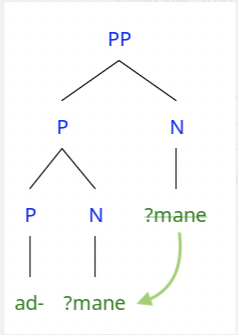
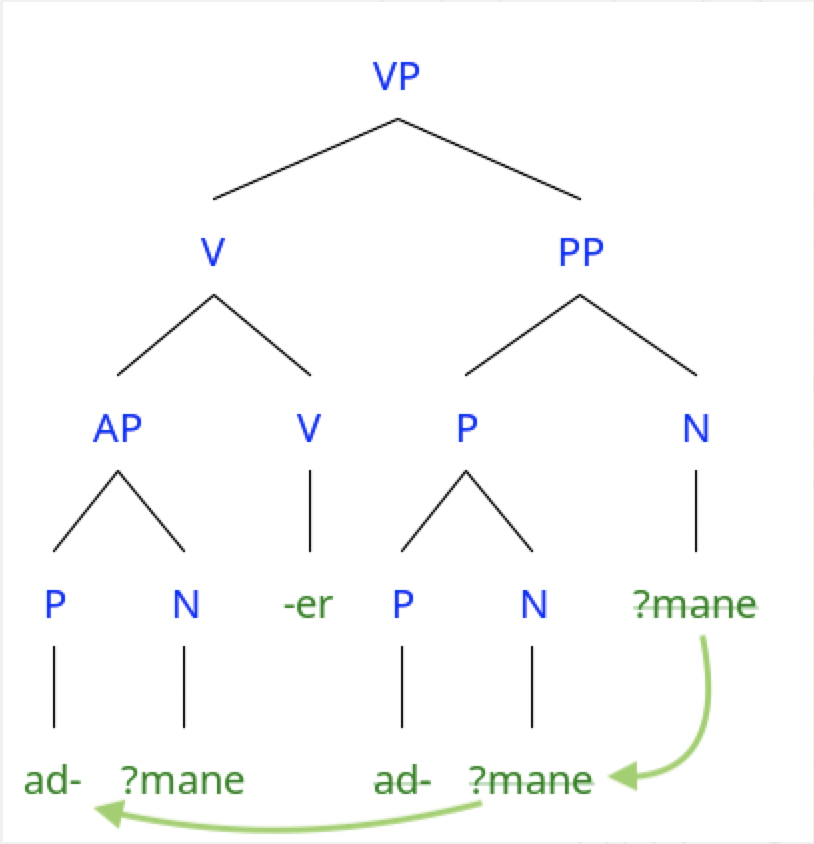

So ... there is this expression in Japanese 'ohayou gozaimasu' that I learned first when I took this introductory class to Japanese culture back during my USB college days in Venezuela. The instructor's name was Sunichi Watanabe and he was a delightful gentleman who taught us about funny snippets of Japanese language and culture that have stayed with me ever since. 

Ohayou gozaimasu, I learned, means 'good morning' and we cheerily used it from that day on at the beginning of class. Shortly after, we started learning about nouns and adjectives and we found out that neither 'good' nor 'morning' or 'day' appear anywhere within the phrase ohayou gozaimasu. Being the curiously minded individual I was, I asked about it. Mr. Watanabe said that it literarily meant something like "existing in the morning'. I thought it was the funniest thing in the world that existing in the morning was the basis for a common greeting. 

Now where I come from we have this expression amanecer and even though we usually start with a buenos días -good morning-, it is not at all uncommon to follow up with a ¿cómo amaneciste? -how did you sleep?- bit. I never realized how weird the word amanecer was until someone asked me - 'no ... what does it really mean?' Because one does not use this expression to ask how someone slept or rested. It is something else that I have had a hard time threading together into a normal-sounding English sentence. 

Halle and Kayser (1993) proposed a theoretical framework that we know as Distributed Morphology (DM) today. DM challenges the idea of what constitutes a word and proposes alternatively that morphology - rather than being an isolated component of the grammar - is distributed along various loci of the grammar system. When we build a word, we start with a bundle of syntactic features that have no phonological content or even much of a meaning content to them. They call that List A or the Formative List.  

When you look at it from that point of view, amanecer is really not that different from ohayou gozaimasu. Here's why ...

There are tons of denominal verbs in both English and Spanish, verbs that come from nouns. Verbs like 'box' and 'saddle' are examples of what we call location and locatum verbs. To box something is to put it in a box; it's a location verb. To saddle something is to put a saddle on something; that's a locatum verb. English isn't great at making an overt distinction between the noun 'box' and the verb 'box'. They look and sound the same. Spanish, on the other hand, tends to leave a morphological breadcrumb trail for us. A 'gaveta' is a drawer. To put things in drawers is 'engavetar' that is 'en-gaveta-r'.

Imagine that we start with an abstract nominal root related to all things morning, we can call that √mane. We know that ad- is an affix coming from Latin with a prepositional meaning encoding direction, tendency, proximity, and contact among other relational properties. The root then moves to the abstract prepositional head. We end up with something like this

So ... there is this expression in Japanese 'ohayou gozaimasu' that I learned first when I took this introductory class to Japanese culture back during my USB college days in Venezuela. The instructor's name was Sunichi Watanabe and he was a delightful gentleman who taught us about funny snippets of Japanese language and culture that have stayed with me ever since. 

Ohayou gozaimasu, I learned, means 'good morning' and we cheerily used it from that day on at the beginning of class. Shortly after, we started learning about nouns and adjectives and we found out that neither 'good' nor 'morning' or 'day' appear anywhere within the phrase ohayou gozaimasu. Being the curiously minded individual I was, I asked about it. Mr. Watanabe said that it literarily meant something like "existing in the morning'. I thought it was the funniest thing in the world that existing in the morning was the basis for a common greeting. 

Now where I come from we have this expression amanecer and even though we usually start with a buenos días -good morning-, it is not at all uncommon to follow up with a ¿cómo amaneciste? -how did you sleep?- bit. I never realized how weird the word amanecer was until someone asked me - 'no ... what does it really mean?' Because one does not use this expression to ask how someone slept or rested. It is something else that I have had a hard time threading together into a normal-sounding English sentence. 

Halle and Keyser (1993) proposed a theoretical framework that we know as Distributed Morphology (DM) today. DM challenges the idea of what constitutes a word and proposes alternatively that morphology - rather than being an isolated component of the grammar - is distributed along various loci of the grammar system. When we build a word, we start with a bundle of syntactic features that have no phonological content or even much of a meaning content to them. They call that List A or the Formative List.  

When you look at it from that point of view, amanecer is really not that different from ohayou gozaimasu. Here's why ...

There are tons of denominal verbs in both English and Spanish, verbs that come from nouns. Verbs like 'box' and 'saddle' are examples of what we call location and locatum verbs. To box something is to put it in a box; it's a location verb. To saddle something is to put a saddle on something; that's a locatum verb. English isn't great at making an overt distinction between the noun 'box' and the verb 'box'. They look and sound the same. Spanish, on the other hand, tends to leave a morphological breadcrumb trail for us. A 'gaveta' is a drawer. To put things in drawers is 'engavetar' that is 'en-gaveta-r'.

Imagine that we start with an abstract nominal root related to all things morning, we can call that √mane. We know that ad- is an affix coming from Latin with a prepositional meaning encoding direction, tendency, proximity, and contact among other relational properties. The root then moves to the abstract prepositional head. We end up with something like this:

The derivation gives up 'ad-√mane-er' which, when sent to SPELLOUT, gives us the expected 'amanecer'. If we were to look at the bits that make up this word, we would find that it shares the same bits that makes ohayou gozaimas the funny expression that I thought it was. After all, preposition-morning-verbing it really isn't that far from 'existing-in-the morning', is it?