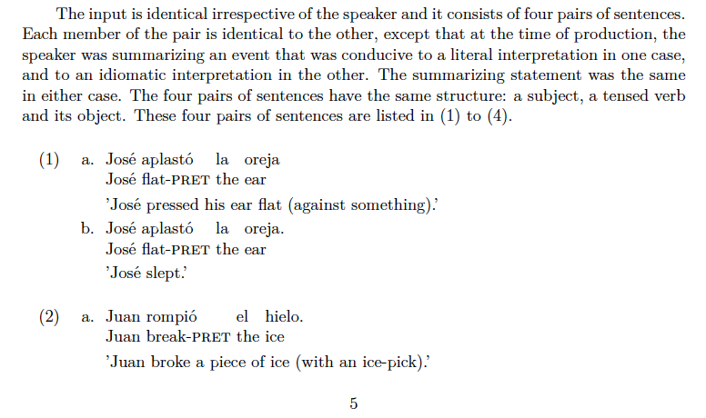

## Part 2 - Writing in R Markdown, inline code, code blocks, and LaTeX environments

The first thing you need to know is that [Markdown](https://www.markdownguide.org/) is a lightweight markup language for plain text editing. R Markdown is the RStudio flavored version of Markdown.

Writing in Markdown is simple because there isn't much to worry about other than your writing. There aren't very many bells and whistles in R Markdown, just plain text.

To write in R Markdown you start with an R Markdown file -rather than an R script -. You'll also need to load a couple of libraries. The `install.packages()` lines you'll need to run only once. The `library()` lines every time you start your session.

```{r, eval=FALSE}
install.packages("R Markdown") 
install.packages("knitr")
library(rmarkdown)
library(knitter)
```

Once you have that going, what you need to know is that an R Markdown document consists of three distinct parts:

1. The YAML header
2. The prose 
3. The code

The YAML header has to appear at the top of your document. The body of the YAML is fenced off by three dashes at the top and three dashes at the bottom. RStudio creates a minimal YAML header that will get you started. It looks like this:

```{r, eval = FALSE}
---
title: "Markdown Document"
author: "Erwin Lares"
date: "12/23/2020"
output: pdf_document: default
---
```

The other two elements of your document, the prose and the code, can appear in any order as you compose your document. Behind this hybrid document is the idea of [literate programming](https://en.wikipedia.org/wiki/Literate_programming) where one provides a narrative of what is being done peppered with the code needed to accomplish the task at hand.

A document compiled that way facilitates reproducibility and minimizes errors as one isn't going manually into the data to copy and paste results. The computer and the code you write take care of that, freeing the researcher to explain the process in a human readable manner.

The prose looks like this very text you are reading. The `code` can be inline like this `x <- 10`. Or it can be fenced off in code blocks. Inline code is useful when you want to fish the value of a variable or run a short calculation and it directly related to your prose.

For example, one can write: "The mean age of the participants is" `mean(exp_02$age)`. So, the backtick ` tells RStudio that I'm starting a line of code. The R (or an r) tells it that it is R code. Then comes the code itself. In this case, I have a dataset called "exp_02". The dataset has a column called "age" when the age of the participants is recorded. I'm asking the computer to calculate the mean of the values in that column. The actual value will appear when the document compiles and will dynamically reflect the data.

A block (or chunk) of code starts and ends with three backticks. Inside the block you have honest-to-god R code, like so:

```{r, eval=FALSE}
#exp_02 contains the data for the perception experiment + demographics + metadata 
exp_02 <- exp %>% 
 select(IP_address:education, starts_with('spk'), feedback, unique_id) %>%
 filter(progress >= 88)
```
 
Once I am ready to run my analysis, I "knit" my document. The prose will stay prose, but every bit of code I wrote will be executed. Variables will be created, calculations carried out, graphs will be plotted, and statistical analyses run. The results will appear where I need them to without having to worry about finding the results and copying them in place or worrying about the formatting.

You'll remember that I said Markdown was a lightweight text editor without very many bells and whistles? What happens when you want to gloss a sentence? You'd be asking the computer to keep track of the sentence number so you can reference it across your document. You'd also want the computer to make the words in the actual gloss and the target sentence align. Unfortunately, R Markdown can't do that.

_But_ LaTeX can! I know what you're thinking … But Erwin, why don't I just write it in LaTeX to begin with? Let's just say that the actual writing in LaTeX is about as fun as driving toothpicks under your fingernails. And truth is, you don't have to write your document in LaTeX to enjoy the capabilities of LaTeX.

All you have to do is open a LaTeX _environment_ within your RMardown document, write the bit that needs the bells and whistles, close the environment, and go on your merry way writing in plain text.

For example, let's say you have the sentence "José aplastó la oreja" and you want it to look like the perfectly glossed example (1). You'll notice that the words in the first and second like are aligned, so you know what corresponds to what, even if you don't speak the target language. You'll also notice that (1) is actually composed of two sub-examples: (1a) and (1b) which sometimes we do that to contrasts features in the language.

```{r, eval = FALSE}
(1) a. José aplastó   la  oreja.
       José flat-PAST the ear
      'José pressed his ear flat (against something).'
    b. José aplastó   la  oreja.
       José flat-PAST the ear
      'José slept.'
```

To get (1), you have to enter the code below. A few details about the code first:

* There are actually two environments `{exe}` and `{list}`. `{exe}` takes care of the plain number examples, i.e. (1). `{list}` takes care of the sub-labels, i.e. (a).  
* Each environment starts with a \begin{<environment>} and ends with a \end{<environment>}.  
* You can add a label to each \ex. I cannot over-emphasize enough how cool this is. Every time you assign a label to an \ex, the computer will take care of numbering them and you'll be able to cross-reference the example across your document. If you give enough thought to your labels, it will make your life easier and you won't have to worry about fishing an example throughout your text when you make changes.  
* To finish your example, you need to add the three lines of text that make up your gloss. End each line with double backslashes which tell the computer that's the end of each line of text. You have to clearly mark them as so.


```{r, eval = FALSE}
\begin{exe}
\ex\label{stm-01} 
\begin{xlist}
\ex\label{stm-01-lit} %1st example
 \gll José aplastó la oreja. \\ %1st line
 José flat-PAST the ear \\ %2nd
 \trans 'José pressed his ear flat (against something).' %3rd
\ex\label{stm-01-idm} %2nd example
 \gll José aplastó la oreja. \\ %1st line
 José flat-PAST the ear \\ %2nd
 \trans 'José slept.' %3rd
\end{xlist}
\end{exe}

```

Remember the part about cross-referencing your examples across your manuscript? Once you had that label and you want to reference it, you'll need to write this bit `\@ref(stm-01` that will become a (1) in your document. If you want the sub-examples, you'll need this bit `\@ref(stm-01-lit)` to get a (1a).

One last detail, the LaTeX magic happens because of a packaged called **gb4e**. You will have to tell R Markdown in the YAML header that you'll be using that package. Notice the additional line right under output

```{r, eval = FALSE}
---
title: "Markdown Document"
author: "Erwin Lares"
date: "12/23/2020"
output: pdf_document: default
- \usepackage{gb4e} \noautomath
---
```

You should be all set and ready to rock your linguistic papers with glosses that perfectly align every time. You can also reference your examples throughout your paper. And if you need to make a change (and you will), R Markdown will track down all the numbering and cross-referencing for you like it does for me here (actual photo of my manuscript!)



Good luck with your writing. If you wanna talk about linguistics or R, get in touch with me at lares@wisc.edu. Infinite thanks to SS, you are objectively the best!
