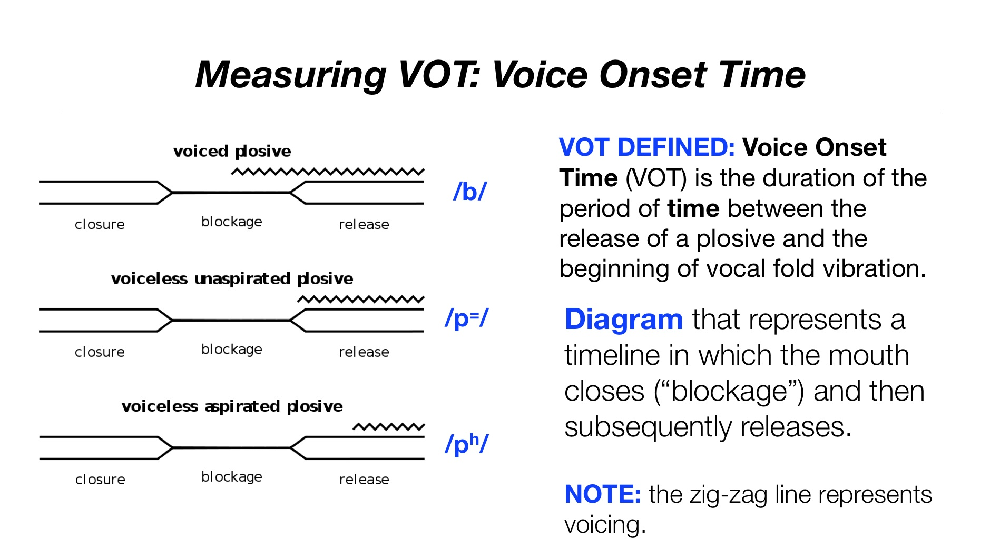

# VOT Development of _La Residencia_ students 

I am collaborating with Rajiv Rao to analyze and visualize the data produced by a longitudinal project studying the pronunciation development of students living in a domestic
immersion program called _La Residencia_.

I am in charge of carrying out the quantitative analysis on the data gathered by this project. The results will be published in a peer-reviewed journal.